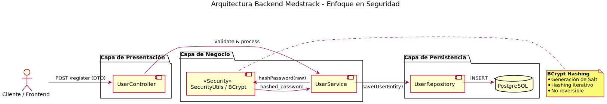

# Medstrack User Management

## Executive Summary

Medstrack User Management es un microservicio backend desarrollado en **Java** con **Spring Boot**,
responsable de la gestión segura de usuarios dentro del ecosistema Medstrack.

El servicio está diseñado bajo principios de arquitectura limpia y separación de responsabilidades,
priorizando seguridad, mantenibilidad y escalabilidad desde etapas tempranas del desarrollo.

Este repositorio forma parte de una plataforma medtech orientada al seguimiento de medicamentos
y recordatorios de salud, y sirve tanto como base funcional del sistema como proyecto de portafolio
profesional enfocado en backend engineering de nivel productivo.

---
## Design Decisions

Las siguientes decisiones de diseño fueron tomadas para asegurar un backend robusto,
seguro y fácil de evolucionar en un entorno medtech:

### Arquitectura en capas
Se adoptó una arquitectura en capas para garantizar una separación clara de responsabilidades
entre controladores, lógica de negocio y persistencia, facilitando el mantenimiento
y la evolución independiente de cada capa.

### Seguridad por diseño
La autenticación y el manejo de credenciales se implementan utilizando Spring Security y
BCrypt, evitando el almacenamiento de contraseñas en texto plano y siguiendo buenas prácticas
recomendadas por OWASP (Open Web Application Security Project).

### Validación en el borde del sistema
Se utiliza Jakarta Bean Validation para asegurar que los datos de entrada sean validados
antes de ingresar a la lógica de negocio, reduciendo errores y estados inconsistentes.

### Persistencia desacoplada
El acceso a datos se abstrae mediante repositorios, permitiendo cambiar la tecnología de
persistencia sin afectar la lógica de negocio.

### Documentación de arquitectura automatizada
La arquitectura del sistema se documenta utilizando PlantUML y se genera automáticamente
mediante GitHub Actions, garantizando que los diagramas estén siempre alineados con el código.

---
## Arquitectura

> **Estado actual:** Fase 1 completada — flujo de registro de usuarios (Sign-Up) implementado y funcional.

El siguiente diagrama describe la arquitectura del microservicio **Medstrack User Management**
durante la **Fase 1**, cuyo alcance principal es el flujo de **registro de usuarios (Sign-Up)**.

El diseño sigue el **C4 Model (niveles Container y Component)** y una **arquitectura en capas**
basada en Spring Boot, con el objetivo de garantizar una separación clara de responsabilidades,
facilitar la ejecución de pruebas automatizadas y permitir la evolución progresiva del microservicio
sin introducir refactorizaciones estructurales.

### Descripción del flujo arquitectónico

1. **Cliente / API Consumer**  
   Un cliente externo (frontend, Postman o pruebas automatizadas) envía una solicitud HTTP
   `POST` al endpoint `/api/usuarios/registro`, proporcionando los datos de registro del usuario.

2. **Controller Layer (UsuarioController)**  
   El controlador actúa como punto de entrada a la API REST.  
   Sus responsabilidades se limitan a:
  - Recibir la solicitud HTTP
  - Validar los datos de entrada mediante DTOs anotados con `@Valid`
  - Delegar la lógica de negocio a la capa de servicio
  - Retornar respuestas HTTP apropiadas

   El controlador no contiene lógica de negocio ni acceso a datos.

3. **Service Layer (UserService)**  
   La capa de servicio encapsula la lógica de negocio del caso de uso *Sign-Up*.  
   En esta fase, sus responsabilidades incluyen:
  - Verificar la existencia previa del correo electrónico
  - Validar que el usuario cumpla las condiciones necesarias para ser registrado
  - Encriptar la contraseña utilizando BCrypt
  - Construir la entidad de dominio `User`
  - Coordinar la persistencia a través del repositorio

   Esta capa es independiente del framework web y es fácilmente testeable de forma aislada.

4. **Persistence Layer (UserRepository)**  
   El repositorio actúa como abstracción del acceso a datos mediante Spring Data JPA.
   Su función es:
  - Ejecutar operaciones CRUD sobre la entidad `User`
  - Persistir y consultar usuarios en la base de datos sin exponer detalles de SQL
  - Evitar que las capas superiores conozcan detalles de persistencia

5. **Base de Datos (PostgreSQL)**  
   La información del usuario se persiste de forma segura en PostgreSQL, almacenando la
   contraseña en formato encriptado y garantizando la unicidad del correo electrónico.

### Consideraciones arquitectónicas

- La arquitectura en capas evita el acoplamiento entre la API, la lógica de negocio y la persistencia.
- El flujo actual cubre completamente el caso de uso de registro de usuarios (Sign-Up).
- La estructura permite extender el microservicio en fases posteriores para incluir
  autenticación (Login), JWT y control de acceso sin modificar el diseño base.

---
