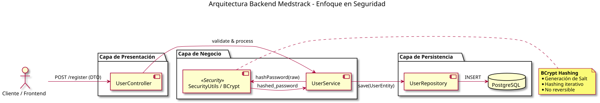

# Medstrack User Management

## Executive Summary

Medstrack User Management es un microservicio backend desarrollado en **Java** con **Spring Boot**,
responsable de la gestión segura de usuarios dentro del ecosistema Medstrack.

El servicio está diseñado bajo principios de arquitectura limpia y separación de responsabilidades,
priorizando seguridad, mantenibilidad y escalabilidad desde etapas tempranas del desarrollo.

Este repositorio forma parte de una plataforma medtech orientada al seguimiento de medicamentos
y recordatorios de salud, y sirve tanto como base funcional del sistema como proyecto de portafolio
profesional enfocado en backend engineering de nivel productivo.

---
## Design Decisions

Las siguientes decisiones de diseño fueron tomadas para asegurar un backend robusto,
seguro y fácil de evolucionar en un entorno medtech:

### Arquitectura en capas
Se adoptó una arquitectura en capas para garantizar una separación clara de responsabilidades
entre controladores, lógica de negocio y persistencia, facilitando el mantenimiento
y la evolución independiente de cada capa.

### Seguridad por diseño
La autenticación y el manejo de credenciales se implementan utilizando Spring Security y
BCrypt, evitando el almacenamiento de contraseñas en texto plano y siguiendo buenas prácticas
recomendadas por OWASP (Open Web Application Security Project).

### Validación en el borde del sistema
Se utiliza Jakarta Bean Validation para asegurar que los datos de entrada sean validados
antes de ingresar a la lógica de negocio, reduciendo errores y estados inconsistentes.

### Persistencia desacoplada
El acceso a datos se abstrae mediante repositorios, permitiendo cambiar la tecnología de
persistencia sin afectar la lógica de negocio.

### Documentación de arquitectura automatizada
La arquitectura del sistema se documenta utilizando PlantUML y se genera automáticamente
mediante GitHub Actions, garantizando que los diagramas estén siempre alineados con el código.

---
## Arquitectura

> **Estado actual:** Fase 1 completada — flujo de registro de usuarios (Sign-Up) implementado y funcional.

El siguiente diagrama describe la arquitectura del microservicio **Medstrack User Management**
durante la **Fase 1**, cuyo alcance principal es el flujo de **registro de usuarios (Sign-Up)**.

El diseño sigue el **C4 Model (niveles Container y Component)** y una **arquitectura en capas**
basada en Spring Boot, con el objetivo de garantizar una separación clara de responsabilidades,
facilitar la ejecución de pruebas automatizadas y permitir la evolución progresiva del microservicio
sin introducir refactorizaciones estructurales.

### Descripción del flujo arquitectónico

1. **Cliente / API Consumer**  
   Un cliente externo (frontend, Postman o pruebas automatizadas) envía una solicitud HTTP
   `POST` al endpoint `/api/usuarios/registro`, proporcionando los datos de registro del usuario.

2. **Controller Layer (UsuarioController)**  
   El controlador actúa como punto de entrada a la API REST.  
   Sus responsabilidades se limitan a:
  - Recibir la solicitud HTTP
  - Validar los datos de entrada mediante DTOs anotados con `@Valid`
  - Delegar la lógica de negocio a la capa de servicio
  - Retornar respuestas HTTP apropiadas

   El controlador no contiene lógica de negocio ni acceso a datos.

3. **Service Layer (UserService)**  
   La capa de servicio encapsula la lógica de negocio del caso de uso *Sign-Up*.  
   En esta fase, sus responsabilidades incluyen:
  - Verificar la existencia previa del correo electrónico
  - Validar que el usuario cumpla las condiciones necesarias para ser registrado
  - Encriptar la contraseña utilizando BCrypt
  - Construir la entidad de dominio `User`
  - Coordinar la persistencia a través del repositorio

   Esta capa es independiente del framework web y es fácilmente testeable de forma aislada.

4. **Persistence Layer (UserRepository)**  
   El repositorio actúa como abstracción del acceso a datos mediante Spring Data JPA.
   Su función es:
  - Ejecutar operaciones CRUD sobre la entidad `User`
  - Persistir y consultar usuarios en la base de datos sin exponer detalles de SQL
  - Evitar que las capas superiores conozcan detalles de persistencia

5. **Base de Datos (PostgreSQL)**  
   La información del usuario se persiste de forma segura en PostgreSQL, almacenando la
   contraseña en formato encriptado y garantizando la unicidad del correo electrónico.

### Consideraciones arquitectónicas

- La arquitectura en capas evita el acoplamiento entre la API, la lógica de negocio y la persistencia.
- El flujo actual cubre completamente el caso de uso de registro de usuarios (Sign-Up).
- La estructura permite extender el microservicio en fases posteriores para incluir
  autenticación (Login), JWT y control de acceso sin modificar el diseño base.

[](docs/architecture/medstrack-architecture.svg)

---
# Documentación de pruebas de integración del MVP de registro de usuarios


En Medstrack, el **módulo de registro de usuarios** es la puerta de entrada a la plataforma, gestionando datos confidenciales como correos electrónicos y contraseñas. Para garantizar su disponibilidad en producción, realizamos un conjunto completo de 10 pruebas de integración con `curl`, estas pruebas validan las funcionalidades principales, los casos extremos, las reglas de validación y la gestión de errores, alineándose con las mejores prácticas como **TDD** (Desarrollo Dirigido por Pruebas) y las canalizaciones de CI/CD.

Esta documentación proporciona **casos de prueba reproducibles**, resultados esperados y resultados reales de la ejecución. Todas las pruebas se ejecutaron en una instancia local de Spring Boot (`http://localhost:808`), utilizando Jakarta Validation para las comprobaciones de entrada y un `GlobalExceptionHandle` personalizado para obtener respuestas de error consistentes. Los resultados confirman una cobertura del 100 % de las rutas críticas, sin regresiones tras las recientes mejoras del controlador.

---

## Entorno de prueba

- **Framework:** Spring Boot 3.x con base de datos **PostgreSQL** para pruebas
- **Herramientas:** `curl 8.1.2` para llamadas a la API
- **Fecha de ejecución:** January 14, 2026
- **Supuestos:** Estado limpio de la base de datos; correos electrónicos únicos para evitar duplicados.

---

## Test Cases

### Test 1: Registro exitoso (caso feliz)
- **Descripción:** Registro de extremo a extremo con datos válidos, incluido cifrado de contraseña y guardado en base de datos.
- **Comando curl:**
```bash
curl -X POST http://localhost:8080/api/usuarios/registro \
-H "Content-Type: application/json" \
-d '{"correo": "mvp1@medstrack.com", "nombre": "Usuario MVP", "password": "password123"}' -v

````
**Salida esperada:** HTTP 200 OK; JSON: `{"success":true,"message":"Usuario registrado correctamente","data":null}`

**Resultado real (de la ejecución):**

````bash
< HTTP/1.1 200
... (security headers)
{"success":true,"message":"Usuario registrado correctamente","data":null}
`````
**Estado:** Aprobado. Demuestra un mapeo DTO sin interrupciones y codificación BCrypt.


### Test 2: Email con formato inválido

- **Descripción:** Prueba la validación de formato `@Email`.
- **Comando curl:**
````bash
curl -X POST http://localhost:8080/api/usuarios/registro \
  -H "Content-Type: application/json" \
  -d '{"correo": "noesemail", "nombre": "Test", "password": "password123"}' -v
````
**Salida esperada:** HTTP 400; JSON con `VALIDATION_ERROR` y detalle de campo para correo.

**Resultado real (de la ejecución):**
````bash
< HTTP/1.1 400
... (headers)
{"success":false,"error":"VALIDATION_ERROR","message":"Datos inválidos en la solicitud","fields":{"correo":"El correo no es valido"}}
````
**Estado:** Aprobado. La capa de validación funciona como se esperaba.


### Test 3: Campo de correo electrónico vacío
- **Descripción:** Prueba `@NotBlank` en busca de campos obligatorios, evitando correos electrónicos nulos o vacíos.
- **Comando curl:**
````bash
curl -X POST http://localhost:8080/api/usuarios/registro \
  -H "Content-Type: application/json" \
  -d '{"correo": "", "nombre": "Test", "password": "password123"}' -v
````
**Salida esperada:** HTTP 400; JSON con error para correo vacío.

**Resultado real (de la ejecución):**
````bash
< HTTP/1.1 400
... (headers)
{"success":false,"error":"VALIDATION_ERROR","message":"Datos inválidos en la solicitud","fields":{"correo":"El correo no puede estar vacio"}}
````
**Estado:** Aprobado. Refuerza la integridad de los datos.

### Test 4: Campo de nombre vacío
- **Descripción:** Valida `@NotBlank` para el nombre, garantizando perfiles de usuario completos.
- **Comando curl:**
````bash
curl -X POST http://localhost:8080/api/usuarios/registro \
  -H "Content-Type: application/json" \
  -d '{"correo": "mvp2@medstrack.com", "nombre": "", "password": "password123"}' -v
````
**Salida esperada:** HTTP 400; JSON with error for nombre vacío.

**Resultado real (de la ejecución):**
````bash
< HTTP/1.1 400
... (headers)
{"success":false,"error":"VALIDATION_ERROR","message":"Datos inválidos en la solicitud","fields":{"nombre":"El nombre no puede estar vacio"}}
````
**Estado:** Aprobado. Validación de campo consistente.


### Test 5: Contraseña demasiado corta

- **Descripción:** Valida `@NotBlank` para el nombre, garantizando perfiles de usuario completos.
- **Comando curl:**
````bash
curl -X POST http://localhost:8080/api/usuarios/registro \
  -H "Content-Type: application/json" \
  -d '{"correo": "mvp3@medstrack.com", "nombre": "Test", "password": "abc"}' -v
````
**Salida esperada:** HTTP 400; JSON con error de longitud de contraseña.

**Resultado real (de la ejecución):**
````bash
< HTTP/1.1 400
... (headers)
{"success":false,"error":"VALIDATION_ERROR","message":"Datos inválidos en la solicitud","fields":{"password":"El password debe tener entre 8 y 12 caracteres"}}
````
**Estado:** Aprobado. Promueve contraseñas seguras.

### Test 6: Contraseña demasiado larga

- **Descripción:** Valida la restricción máxima `@Size` para evitar entradas demasiado largas.
- **Comando curl:**
````bash
textcurl -X POST http://localhost:8080/api/usuarios/registro \
-H "Content-Type: application/json" \
-d '{"correo": "mvp4@medstrack.com", "nombre": "Test", "password": "password123456"}' -v
````
**Salida esperada:** HTTP 400; JSON con error de longitud de contraseña.

**Resultado real (de la ejecución):**
````bash
text< HTTP/1.1 400
... (encabezados)
{"success":false,"error":"VALIDATION_ERROR","message":"Datos inválidos en la solicitud","fields":{"password":"La contraseña debe tener entre 8 y 12 caracteres"}}
````
**Estado:** Aprobado. Equilibra la seguridad y la usabilidad.

### Test 7: Registro de correo electrónico duplicado

- **Descripción:** Comprueba la lógica de negocio para la unicidad del correo electrónico mediante una verificación de la base de datos.
- **Comando curl:**
````bash
textcurl -X POST http://localhost:8080/api/usuarios/registro \
-H "Content-Type: application/json" \
-d '{"correo": "mvp1@medstrack.com", "nombre": "Duplicado", "password": "password123"}' -v
````
**Salida esperada:** HTTP 409; JSON con `BUSINESS_ERROR`.

**Resultado real (de la ejecución):**
````bash
text< HTTP/1.1 409
... (encabezados)
{"success":false,"error":"BUSINESS_ERROR","message":"El correo ya está registrado","fields":null}
````
**Estado:** Aprobado. Evita la duplicación de datos.

### Test 8: Entrada JSON malformada

- **Descripción:** Garantiza la resiliencia ante cuerpos de solicitud no válidos.
- **Comando curl:**
````bash
textcurl -X POST http://localhost:8080/api/usuarios/registro \
-H "Content-Type: application/json" \
-d 'esto definitivamente no es JSON { inválido' -v
````
**Salida esperada:** HTTP 400; JSON con `INVALID_JSON`.

**Resultado real (de la ejecución):**
````bash
text< HTTP/1.1 400
... (encabezados)
{"success":false,"error":"INVALID_JSON","message":"El formato JSON es inválido o el cuerpo de la solicitud no puede ser leído","fields":null}
````
**Estado:** Aprobado. Controlador personalizado para analizar errores.

### Test 9: Campo obligatorio faltante (sin correo electrónico)

- **Descripción:** Verifica el manejo de los campos obligatorios omitidos.
- **Comando curl:**
````bash
textcurl -X POST http://localhost:8080/api/usuarios/registro \
-H "Content-Type: application/json" \
-d '{"nombre": "Sin correo", "password": "password123"}' -v
````
**Salida esperada:** HTTP 400; JSON con error de correo vacío.

**Resultado real (de la ejecución):**
````bash
text< HTTP/1.1 400
... (encabezados)
{"success":false,"error":"VALIDATION_ERROR","message":"Datos inválidos en la solicitud","fields":{"correo":"El correo no puede estar vacío"}}
````
**Estado:** Aprobado. Se considera vacío lo que falta.

### Test 10: múltiples errores de validación simultáneos

- **Descripción:** prueba la agregación de múltiples fallas de validación.
- **Comando curl:**
````bash
textcurl -X POST http://localhost:8080/api/usuarios/registro \
  -H "Tipo de contenido: aplicación/json" \
  -d '{"correo": "emailinvalido", "nombre": "", "contraseña": "123"}' -v
````
**Salida esperada:** HTTP 400; JSON con varios campos erróneos.

**Resultado real (de la ejecución):**
````bash
texto< HTTP/1.1 400
... (encabezados)
{"success":false,"error":"VALIDATION_ERROR","message":"Datos inválidos en la solicitud","fields":{"password":"La contraseña debe tener entre 8 y 12 caracteres","correo":"El correo no es válido","nombre":"El nombre no puede estar vacio"}}
````
**Estado:** Aprobado. Todos los errores se agregaron limpiamente.
